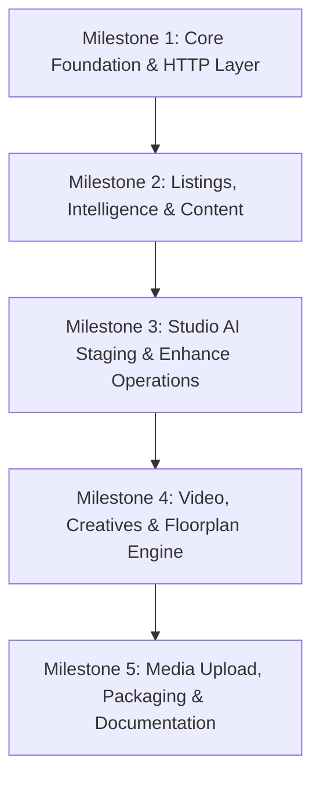

# mlsapi.dev TypeScript / JavaScript SDK Specification

> **Official TypeScript & Node.js client library specification for `mlsapi.dev` — Real estate MLS listing ingestion, property intelligence, automated marketing content, and Studio generative AI.**

---

## 1. Executive Summary & Vision

The `mlsapi` TypeScript/JavaScript SDK provides developers, real estate platforms, PropTech startups, and agencies with an idiomatic, strongly-typed, modern Node.js and browser/edge client for interacting with the `mlsapi.dev` platform.

Following the architecture established in the `mlsapi.dev` core server and the companion WordPress Studio plugin, this SDK unifies two major operational domains into a seamless API experience:

1. **MLS Data & Property Intelligence Engine:**
   - Real-time MLS listing lookup and asynchronous ingestion.
   - Comprehensive property intelligence, CapEx lifecycle analysis, system conditions, and investor-grade financial synthesis.
   - Automated multi-channel marketing content generation (Instagram captions, Facebook posts, LinkedIn breakdowns, video scripts, print flyer bullets, and MLS remarks).

2. **Studio Visual AI & Generative Media Engine:**
   - Virtual room staging across 29 interior design styles and 12 room types.
   - Day-to-dusk twilight conversion and exterior enhancement (blue skies, manicured lawns, pool cleaning).
   - Room decluttering, full room de-staging (emptying), and style restyling.
   - In-place furniture replacement and surface material swap (flooring, countertops, cabinetry).
   - 3x3 wall paint color comparison swatch grids.
   - 2D architectural blueprint analysis & 3D isometric dollhouse cutaway renders.
   - 4K super-resolution upscaling and CAD/sketch architectural photoreal rendering.
   - Branded multi-placement ad creative generation and direct multi-platform social publishing.
   - Video walkthrough reel generation, realtor video polish (studio voice, Hormozi-style animated captions, auto-reframe), and before/after transition morphs.

---

## 2. Design Principles & Goals

* **TypeScript-First & Deeply Typed:** Complete typings, enums, unions, and interfaces mirroring the backend domain models with autocompletion and IntelliSense for all options (e.g. 29 interior styles, room types, placements, and output formats).
* **Dual Execution Modes (Async Job vs. Auto-Wait):**
  Generative AI models and property scrapers take between 5 to 30 seconds. All async endpoints return a `Job` object (`202 Accepted`) by default, but each method provides a companion `*AndWait()` or `{ wait: true }` option with smart exponential backoff polling, progress callbacks, and configurable timeouts.
* **Isomorphic & Universal Runtime:**
  Built on web-standard `fetch`, `FormData`, and `Blob`. Works seamlessly across Node.js 18+, Bun, Deno, Cloudflare Workers, Vercel Edge Runtime, Next.js (App & Pages routers), Nuxt, Remix, and modern browsers.
* **Zero Heavy Dependencies:**
  Uses standard native primitives with optional lightweight utilities for form-data streaming and binary buffers.
* **Resilient by Default:**
  Configurable automatic retries with exponential backoff and jitter on 429 rate limits and 5xx transient server errors.
* **Unified Media Upload:**
  Convenient asset uploader accepting File objects, Buffers, ReadableStreams, or local file system paths (in Node.js).

---

## 3. Package Structure & Distribution

```text
sdks/js/
├── src/
│   ├── index.ts                 # Main public package entrypoint
│   ├── client.ts                # Primary MlsApiClient class
│   ├── config.ts                # Configuration options & defaults
│   ├── errors.ts                # Typed error class hierarchy
│   ├── http.ts                  # Underlying fetch wrapper, auth, retries
│   ├── poller.ts                # Polling engine with backoff & timeouts
│   ├── resources/
│   │   ├── listings.ts          # MLS listing ingestion & lookup
│   │   ├── intelligence.ts      # LLM property intelligence & CapEx
│   │   ├── content.ts           # Marketing copy & content generator
│   │   ├── studio/
│   │   │   ├── index.ts         # Studio namespace aggregator
│   │   │   ├── staging.ts       # Staging, declutter, empty, restyle, furniture, materials, paint
│   │   │   ├── enhance.ts       # Exterior enhancement & 4K upscaling
│   │   │   ├── floorplan.ts     # Blueprint analysis & 3D dollhouse rendering
│   │   │   ├── render.ts        # Architectural CAD / sketch renders
│   │   │   ├── creatives.ts     # Ad creatives & brand kits
│   │   │   ├── social.ts        # Direct social network publishing
│   │   │   ├── video.ts         # Video enhance, reels, walkthroughs, transitions
│   │   │   ├── upload.ts        # Image and video media upload helper
│   │   │   └── jobs.ts          # Studio job status tracking & polling
│   │   └── account/
│   │       ├── billing.ts       # Credit meter, usage, Stripe subscription
│   │       └── keys.ts          # API key verification & management
│   └── types/
│       ├── listings.ts          # Base listing, addresses, specs, features
│       ├── intelligence.ts      # System conditions, CapEx, investor insights
│       ├── content.ts           # Social copy, video scripts, remarks types
│       ├── studio.ts            # Styles, rooms, operations, requests/responses
│       └── common.ts            # Job status, pagination, HTTP options
├── test/
│   ├── client.test.ts           # Client initialization & auth tests
│   ├── listings.test.ts         # Listing & intelligence tests
│   ├── studio.test.ts           # Studio operation dispatch & wait tests
│   └── poller.test.ts           # Polling backoff & retry tests
├── package.json
├── tsconfig.json
├── tsconfig.build.json
├── README.md                    # Developer guide and full examples
└── SPEC.md                      # This specification document
```

---

## 4. Client API Architecture

### 4.1 Client Initialization

```typescript
import { MlsApiClient } from 'mlsapi';

const mls = new MlsApiClient({
  apiKey: process.env.MLSAPI_KEY,      // Required (or via MLSAPI_KEY env)
  environment: 'live',                // 'live' | 'test' (default: 'live')
  baseUrl: 'https://mlsapi.dev',   // Optional custom base URL
  timeoutMs: 60_000,                  // Request timeout (default: 60s)
  maxRetries: 3,                      // Automatic retries on 429/5xx (default: 3)
});
```

### 4.2 Resource Namespace Hierarchy

```text
mls
├── listings
│   ├── get(mlsId, options?)
│   ├── getAndWait(mlsId, options?)
│   ├── enqueue(mlsId, options?)
│   ├── getJob(jobId)
│   └── listJobs(options?)
│
├── intelligence
│   └── get(mlsId, options?)
│
├── content
│   └── generate(mlsId, options?)
│
├── studio
│   ├── staging
│   │   ├── stage(params) / stageAndWait(params)
│   │   ├── declutter(params) / declutterAndWait(params)
│   │   ├── empty(params) / emptyAndWait(params)
│   │   ├── restyle(params) / restyleAndWait(params)
│   │   ├── replaceFurniture(params) / replaceFurnitureAndWait(params)
│   │   ├── replaceMaterial(params) / replaceMaterialAndWait(params)
│   │   ├── wallColors(params) / wallColorsAndWait(params)
│   │   └── twilight(params) / twilightAndWait(params)
│   │
│   ├── enhance
│   │   ├── exterior(params) / exteriorAndWait(params)
│   │   └── upscale(params) / upscaleAndWait(params)
│   │
│   ├── floorplan
│   │   ├── analyze(params)
│   │   └── render3d(params) / render3dAndWait(params)
│   │
│   ├── render
│   │   └── architectural(params) / architecturalAndWait(params)
│   │
│   ├── creatives
│   │   └── generate(params) / generateAndWait(params)
│   │
│   ├── social
│   │   └── publish(params)
│   │
│   ├── video
│   │   ├── enhance(params) / enhanceAndWait(params)
│   │   ├── walkthrough(params) / walkthroughAndWait(params)
│   │   ├── transition(params) / transitionAndWait(params)
│   │   └── tour(params) / tourAndWait(params)
│   │
│   ├── custom(params) / customAndWait(params)
│   │
│   ├── upload(file, options?)
│   │
│   └── jobs
│       ├── get(jobId)
│       └── waitFor(jobId, options?)
│
└── account
    ├── getBillingOverview()
    └── verifyKey()
```

---

## 5. Domain Modules & API Reference

### 5.1 Listings & Ingestion (`mls.listings`)

#### Methods
- `mls.listings.get(mlsId: string, options?: ListingLookupOptions): Promise<BaseListing | IngestJob>`
  Retrieves normalized listing data. If the listing is newly encountered, the backend enqueues an ingestion job and returns HTTP `202 Accepted` with an `IngestJob`.
- `mls.listings.getAndWait(mlsId: string, options?: WaitOptions): Promise<BaseListing>`
  Automatically polls until ingestion completes, then returns the resolved `BaseListing`.
- `mls.listings.enqueue(mlsId: string, options?: EnqueueOptions): Promise<EnqueueIngestResponse>`
  Explicitly triggers background MLS scraping and photo ingestion.
- `mls.listings.getJob(jobId: string): Promise<IngestJobRecord>`
  Retrieves status and progress percentage of an ingestion job.

---

### 5.2 Property Intelligence (`mls.intelligence`)

Synthesizes public records, tax assessment history, school ratings, physical Capex lifespan analysis (roof, HVAC, plumbing, impact windows), and investor cashflow metrics.

#### Method
- `mls.intelligence.get(mlsId: string, options?: IntelligenceOptions): Promise<PropertyIntelligence>`
  - `options.includeLlm`: boolean (default `true`) — include deep AI architectural & financial analysis.
  - `options.investorMode`: boolean (default `false`) — calculate gross rental yield, estimated rent range, and HOA flag evaluation.

---

### 5.3 Context-Aware Content Generation (`mls.content`)

Generates marketing copy tuned to specific tones and channels directly from property facts.

#### Method
- `mls.content.generate(mlsId: string, options: ContentGenerationRequest): Promise<ContentGenerationResult>`
  - `outputs`: `("social" | "email_blast" | "video_script" | "flyer_bullets" | "mls_remarks" | "investor_pitch")[]`
  - `tone`: `"luxury" | "professional" | "approachable" | "investor_focused" | "storytelling" | "urgent_deal"`
  - `social_platforms`: `("instagram" | "facebook" | "linkedin" | "x_twitter" | "tiktok" | "youtube")[]`
  - `target_audience`: string (e.g. `"First-time millennial homebuyers"`)
  - `property_details`: Optional direct data override to write copy for unlisted or off-market properties.

---

### 5.4 Studio Visual AI (`mls.studio`)

All Studio operations connect to `/v1/studio/*` endpoints. Operations accept an input image URL (or uploaded asset) and parameters.

#### 1. Virtual Staging (`mls.studio.staging.stage` / `stageAndWait`)
Furnish empty room photos with photorealistic furniture.
- Parameters: `photo_url`, `room_type`, `style` (one of 29 curated architectural styles), `preserve_flooring`, `custom_staging_instructions`, `webhook_url`.
- Result: `staged_photo_url`, `before_after_comparison_url`, `staging_manifest`.

#### 2. Room Decluttering (`mls.studio.staging.declutter` / `declutterAndWait`)
Remove cords, trash, clutter, moving boxes, and personal items while preserving room layout and architecture.
- Parameters: `photo_url`, `room_type`, `removal_targets`.
- Result: `decluttered_photo_url`, `before_after_comparison_url`, `items_removed`.

#### 3. Room Empty / De-Staging (`mls.studio.staging.empty` / `emptyAndWait`)
Strip all furniture down to the bare architectural space, with optional floor restoration.
- Parameters: `photo_url`, `room_type`, `restore_flooring` (`"hardwood"` | `"tile"` | `"carpet"` | `"polished_concrete"`).

#### 4. Restyling (`mls.studio.staging.restyle` / `restyleAndWait`)
Transform existing furnished rooms into a new design style (e.g. rustic to scandinavian) while preserving space geometry.

#### 5. Furniture Replacement (`mls.studio.staging.replaceFurniture` / `replaceFurnitureAndWait`)
Swap out a specific piece of furniture (e.g. dated sofa) with a new style or an exact reference product image.
- Parameters: `room_photo_url`, `target_furniture`, `reference_product_image_url`, `product_description`.

#### 6. Surface Material Replacement (`mls.studio.staging.replaceMaterial` / `replaceMaterialAndWait`)
Resurface countertops, backsplash, flooring, or cabinetry using textures or material presets.
- Parameters: `room_photo_url`, `surface_type`, `material_sample_image_url`, `material_preset`.

#### 7. Wall Paint Color Swatches (`mls.studio.staging.wallColors` / `wallColorsAndWait`)
Generate a 3x3 comparison grid of curated designer wall paint swatches applied to the room.

#### 8. Twilight & Dusk Conversion (`mls.studio.staging.twilight` / `twilightAndWait`)
Day-to-dusk conversion with interior window glows and landscape lighting.
- Modes: `"day_to_dusk"` or `"blue_sky_replace"`.

#### 9. Exterior Enhancement (`mls.studio.enhance.exterior` / `exteriorAndWait`)
Turn overcast skies blue, green up brown lawns, clean swimming pools, and tidy gardens.
- Enhancements array: `["blue_sky", "green_grass", "clean_pool", "tidy_garden"]`.

#### 10. 4K Upscale (`mls.studio.enhance.upscale` / `upscaleAndWait`)
Enhance low-resolution MLS photos to crisp 4K print-ready images.
- Parameters: `image_url`, `scale_factor` (2 or 4), `enhance_details`.

#### 11. 2D Floor Plan to 3D Isometric Dollhouse (`mls.studio.floorplan`)
- `mls.studio.floorplan.analyze`: Extract room vectors, dimensions, and generate design prompts.
- `mls.studio.floorplan.render3d`: Render cutaway 3D isometric dollhouse views.

#### 12. Architectural CAD / Sketch Render (`mls.studio.render.architectural`)
Render CAD blueprints, SketchUp models, or raw pencil drawings into photorealistic interior or exterior renders.

#### 13. Ad Creatives & Social Publishing (`mls.studio.creatives` / `mls.studio.social`)
- Generate compliant multi-format ad assets (1:1 feed, 9:16 vertical stories, 16:9 flyers) with agent branding kits.
- Directly dispatch assets to Instagram, Facebook, LinkedIn, TikTok, or YouTube Shorts.

#### 14. Video Automation (`mls.studio.video`)
- `enhance`: Polish walking tour video with studio-grade voice enhancement, Hormozi-style animated subtitles, and automatic 9:16 re-framing.
- `walkthrough`: Generate vertical video reel from photos with AI narration and background music.
- `transition`: Generate smooth morph or renovation timelapse video between two images.
- `tour`: Combine multi-room photos into a continuous cinematic house tour reel.

---

### 5.5 Media Upload (`mls.studio.upload`)

Convenience helper to upload local images or binary buffers to the `mlsapi.dev` global CDN storage before triggering Studio operations.

```typescript
// From a local file path (Node.js)
const asset = await mls.studio.upload('./living-room.jpg');

// From a Buffer or Uint8Array
const asset = await mls.studio.upload(imageBuffer, { filename: 'bedroom.png', contentType: 'image/png' });

// Use the resulting URL in any Studio operation
const staged = await mls.studio.staging.stageAndWait({
  photo_url: asset.url,
  room_type: 'living_room',
  style: 'scandinavian',
});
```

---

## 6. Smart Polling & Asynchronous Execution

Because AI image generation and video production take between 5 to 30 seconds, the SDK provides first-class asynchronous handling:

```typescript
// 1. Direct Polling with Progress Callbacks
const result = await mls.studio.staging.stageAndWait(
  {
    photo_url: 'https://images.mlsapi.dev/raw/sample1.jpg',
    room_type: 'living_room',
    style: 'modern',
  },
  {
    pollIntervalMs: 2_000,
    timeoutMs: 120_000,
    onProgress: (job) => {
      console.log(`[${job.progress_percentage}%] ${job.current_step}`);
    },
  }
);

// 2. Or Manual Job Polling
const job = await mls.studio.staging.stage({ photo_url: '...' });
console.log(`Job queued with ID: ${job.job_id}`);

const finalJob = await mls.studio.jobs.waitFor(job.job_id, {
  pollIntervalMs: 2_500,
  timeoutMs: 90_000,
});
console.log('Result image:', finalJob.result.staged_photo_url);
```

---

## 7. Error Handling & Resilience

### 7.1 Error Hierarchy

```text
Error
└── MlsApiError (base SDK error with status, code, requestId)
    ├── AuthenticationError (401 - Invalid/missing API key)
    ├── PermissionDeniedError (403 - Plan tier restriction or expired key)
    ├── NotFoundError (404 - Listing or job ID not found)
    ├── InvalidRequestError (400 - Missing required parameters or malformed payload)
    ├── RateLimitError (429 - Quota exceeded or rate limited)
    ├── StudioJobFailedError (Job processed by worker but failed)
    └── JobTimeoutError (Polling exceeded maximum configured timeout)
```

### 7.2 Automatic Retries
- Retries with exponential backoff on `429 Too Many Requests` and `5xx Server Error`.
- Safe idempotent retries (GET/PUT/DELETE, and POST when designated).
- Configurable via `maxRetries` option.

---

## 8. Implementation Roadmap



* **Milestone 1:** Project setup, TypeScript build configuration (ESM/CJS), HTTP client with authentication, error hierarchy, and polling engine.
* **Milestone 2:** Types and methods for `mls.listings`, `mls.intelligence`, and `mls.content`.
* **Milestone 3:** Core Studio visual operations (`staging`, `declutter`, `empty`, `restyle`, `twilight`, `furniture`, `material`, `wall-colors`, `exterior`, `upscale`).
* **Milestone 4:** Floorplan 3D isometric dollhouse, architectural renders, ad creatives, social publishing, and video workflows.
* **Milestone 5:** Media upload multipart handler, account/billing methods, full unit/integration test suite, and release packaging.
